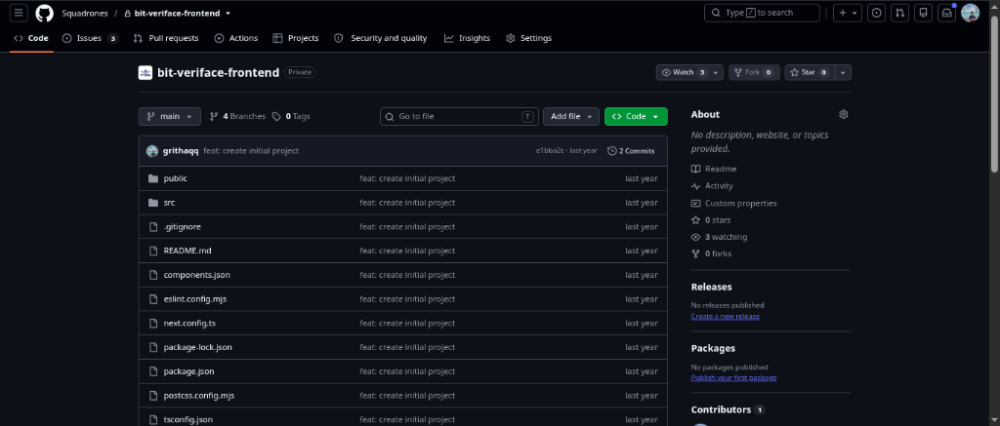
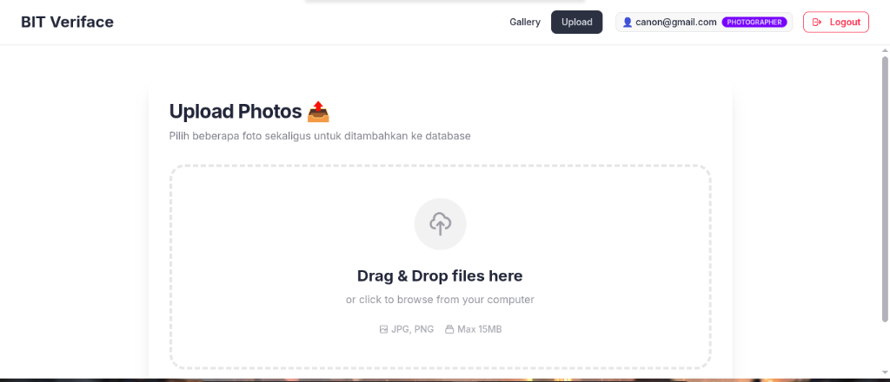
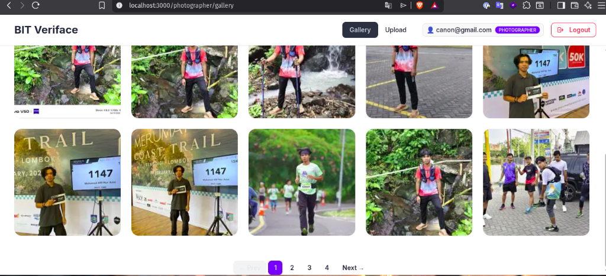
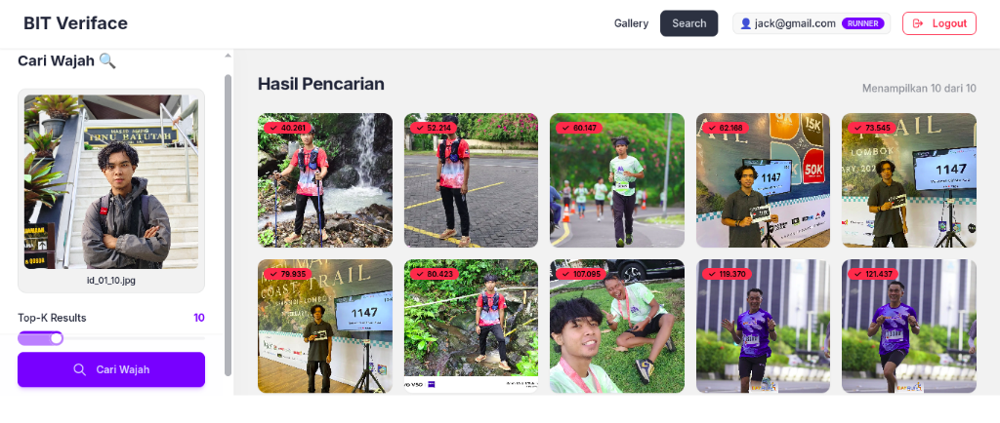

# bit-veriface_fe

Welcome to the **bit-veriface_fe** frontend application. This project is built using Next.js, Tailwind CSS, and uses `bun` as the package manager. It serves as the user interface for the BIT-Veriface prototype.

## About this Project

> **Note:** This repository contains the frontend source code for an application originally developed during a research and internship period at **Squadrones** approximately 2 years ago (circa 2024). 
> 
> *The original development repository and URL are kept private. This repository serves as a published version for academic and portfolio purposes.*

<details>
<summary><b>View Original Repository History Proof</b></summary>



</details>

## Prerequisites

Ensure you have the following installed on your machine:
- [Bun](https://bun.sh/) (Fast JavaScript runtime and package manager)
- Node.js (v18 or newer recommended for Next.js)

## Installation Guide

Follow these steps to set up your local development environment:

### 1. Set Up Environment Variables

This project requires environment variables to properly connect to the backend API.

Copy the provided example file to create your local environment configuration:
```bash
cp .env.example .env.local
```

Open the newly created `.env.local` and ensure the API URL points to your running backend. By default, it is configured as:
```env
NEXT_PUBLIC_API_URL='http://0.0.0.0:8005'
```

### 2. Install Dependencies

Since this project explicitly uses **Bun** for dependency management, run the following command to install all required packages quickly and cleanly:
```bash
bun install
```

### 3. Run the Development Server

Once dependencies are installed, start the local development server by running:
```bash
bun run dev
```

Open [http://localhost:3000](http://localhost:3000) in your browser to see the application running.

## Features & UI Walkthrough

Here are some key interfaces of the BIT-Veriface application:

### 1. Photographer Upload
The photographer interface allows uploading multiple photos at once with a simple drag-and-drop mechanism.


### 2. Photographer Gallery
All uploaded photos are presented in a clean, responsive grid layout for easy management.


### 3. Runner Face Search
Runners can search for their faces across all uploaded photos. The system uses a facial recognition vector database (DeepFace/Milvus) and returns the top-K closest matches ranked by distance score.

